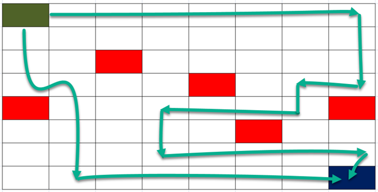

## OIT ITEC597 期中考试

### 代码提交方式
* Fork此Repository，完成代码编写后提交自己的GitHub Repository地址即可
* 为了方便对大家提交的代码进行统一测试打分，请务必保留`resolve`方法
* 可以根据需要自由添加辅助类、辅助方法等
* POM依赖中不得添加任何其他类库，只允许使用普林斯顿大学的`algs4`和用于编写单元测试用例的`junit5`
* 提交截止时间：2019年5月19日之前
* 问题报告：如果您发现题目描述不清晰，或题目本身存在Bug，请及时与我联系
* 注意事项、题意讲解视频：[YouTuBe Link](https://www.youtube.com/watch?v=-MPbXEeZOxs&t=93s)


### 第一题：圣经学者的烦恼(4分)

* 难易程度：简单
* 背景说明：王江牧师惯于每日早晨在山中漫步默想，复活节后的第一个早晨，他研读英王钦定本之时，忽然想基于圣经文本的词频来发掘其中潜藏的深意。逐节、逐词统计的工作量让人望而生畏，于是他找到你来帮助他解决这个问题。王江牧师只关注有意义的英文词汇，冠词、介词及代词等希望一概忽略不计，所以他额外提供了一份停词过滤表，方便你进行统计时将它们排除在外。  

  考虑到圣经词汇量相当可观，王江牧师只关注出现频率最高的12个单词和频率最低的12个单词。
* 编程要求：[BibleScholar.java](src/main/java/BibleScholar.java)，实现`public String[] resolve()`方法
* 数据来源：`kjv.txt`和`stopwords.txt`
* 输出格式：返回一个字符串数组，前12个为频率最高的单词，后12个为频率最低的单词。数组中
每个元素的格式如下：  
  ```
  ${word}:${count}
  例如：
  lord:7830
  god:4442
  ```
* 注意事项
  + 输出单词一律为小写
  + 定位某一单词是否为停词的时间复杂度需为O(1)
  + 考虑到我们只关注最高、最低各12个单词，词频信息汇总完毕之后，禁止直接对其排序！
  + 定位24个单词的时间复杂度不得高于O(n * 2 * log(12))，其中n为汇总的词频信息集合元素总数
  + 24个单词均按照出现次数降序排列在输出数组中，如果出现次数相同，按照单词本身降序排列，以下为一个输出样本(注意：仅为样本！)：
    ```java
    lord:7830
    god:4442
    said:3999
    man:2613
    israel:2565
    son:2370
    king:2258
    people:2139
    came:2093
    house:2024
    come:1971
    one:1967
    abi:1
    abhorring:1
    abez:1
    abelshittim:1
    abelmizraim:1
    abelmaim:1
    abdiel:1
    abdeel:1
    abasing:1
    abana:1
    abagtha:1
    abaddon:1
    ```
  + 程序运行时间不得超过3秒，如您确信是因为电脑相对老旧导致运行时间无法达标，请及时联系我进行确认


### 第二题：古旧的修道院(5分)

* 难易程度：中等
* 背景说明：谷红星牧师夫妇前往南美传教，正为OC地址愁苦之时，一位天主教修士忽然找到他们，说某处有一古旧的修道院出售，是否考虑前去看看？  

  大喜过望的红星牧师立马赶到现场，很快他发现这确实是一所相当古旧的修道院，然而稍加整理修缮，仍然可以妥善使用。他绘制了一份修道院内部结构图如下：
  ```java
  3 2 6 3 6
  1 8 4 1 4
  13 7 13 9 4
  3 0 2 6 5
  9 8 8 12 13
  ```

  这谜一般的结构图，红星牧师提供的解密结果如下：
  + 这是一所有25个独立房间的修道院
  + 各个独立房间可能连通，也可能被墙垣阻隔
  + 为了方便记录，红星牧师定义了四个方向：西1，北2，东4，南8
  + 以第一个房间为例，左、上有墙但右、下无墙，因而第一个房间与右、下均连通
  + 修道院外围都必须被墙包围保护，免去风雨之苦
  + 现在红星牧师开始思考，这一修道院内部有多少个连通的区域？
  + 最大的区域中包含多少个房间？
  + 为了方便未来规划，如果拆除且仅拆除一堵墙之后可以腾出最大空间，该空间会有多大？
  + 以及：我们应该拆除哪堵墙？
  + 考虑到施工的难易程度，当不同的墙垣拆除之后所得最大区域相等时，优先考虑左侧，其次考虑下方，再次优先考虑朝北方向墙壁
* 编程要求: [Monastery.java](src/main/java/Monastery.java)，实现
`public int[] resolve(int[][] rooms)`这一方法，返回一个数组，该数组的每个元素依次是：
  + 第一个元素：修道院中联通的区域数
  + 第二个元素：最大的区域有几个房间？
  + 第三个元素：拆除一堵墙之后最大区域会有几个房间？
  + 第四、五、六个元素：待拆除的墙所在位置及方向
  + 上述样例输入返回结果应为：`[3, 9, 17, 4, 1, 2]`，参见下图：
  
  + 说明：如图所示有三个区域，最大区域有9个房间，如将第四行、第一列的房间朝北方向墙壁拆除，则可得到一个包含17个房间的连通区域。需要注意的是拆除其他墙壁虽然也能得到同等大小区域，但我们按照从左到右、从下到上的顺序进行处理，因而最终以第四行、第一列、朝北方向为施工依据。
  + 参数范围：1 < `rooms.length` <= 50, 1 < `rooms[0].length` <= 50
  + 程序运行时间不得超过2秒，如您确信是因为电脑相对老旧导致运行时间无法达标，请及时联系我进行确认


### 第三题：圣殿骑士的银行(7分)

* 难易程度：中等偏难
* 背景说明：为保护朝圣信徒而出现的[圣殿骑士团](https://en.wikipedia.org/wiki/Knights_Templar)，极有创意地发明了银行系统。他们允许旅客在出发前将钱币、财物储存在某地，到达圣地之后即可在指定地点提取，这一定程度缓解了旅客因为随身携带过多财物而被抢劫甚至杀害的概率。与此同时，各地的货币系统可能存在差异，导致旅客在不同地域所能兑换、提取的钱币形式都不相同。现在，有一位历经千辛万苦到达耶路撒冷的天路客，正要前往圣殿骑士团的据点取回自己存储的钱币。
* 编程要求: [KnightsTemplarBank.java](src/main/java/KnightsTemplarBank.java)，实现
`public int[] resolve(int amount, int[] options)`方法
  + amount为朝圣客需要提取的钱币数量
  + options为圣殿骑士团银行系统的不同面值，比如1、2、5、10、25
  + 返回圣殿骑士团银行职员可以提供给朝圣客的不同面值数量组合方式总数及最少钱币组合数。
  比如朝圣客需提取总值5银币，那么可以有4种方法（5 * 1, 1 + 2 * 2，3 * 1 + 2，1 * 5）
  最少钱币数量的给予方式是1枚面值为5的银币。这两个数值请以数组形式返回：`{4, 1}`
  + 特定情况下可能无法完成提取（比如面值只有10、25时），此时请返回`{-1, -1}`
  + 1 <= `amount` <= 10000, 1 <= `options[i]` <= 25, 1 <= options.length <= 5
  + 程序运行时间不得超过2秒，如您确信是因为电脑相对老旧导致运行时间无法达标，请及时联系我进行确认


### 第四题：使徒保罗的传教之旅(7分)

* 难易程度：中等(偏难：当地图较大时)
* 背景说明：使徒保罗一直渴望能够“直到地极，做主的见证”，虽然常有阻隔，但计划从未停止。在哥林多代笔罗马书的德丢弟兄，自告奋勇要为使徒保罗设计传教路线。这一路线起自耶路撒冷，终于当时人们心中的地极他施（今日之西班牙）。鉴于当时极端犹太教徒对保罗恨之入骨，行进过程中不能不避开他们。面对巨大的地图，德丢很快发现这是一个相当艰巨的任务，于是他一头扎入繁琐的计算当中。你能帮助他快速定位到所有可能路线吗？因为传教旅程的不确定性，德丢不能只关注最短路线。
* 编程要求：[MissionTrip.java](src/main/java/MissionTrip.java)
  实现`public int resolve(int[][] paths)`方法，找到使徒保罗从起点`[0, 0]`开始，走到终点的所有路径总数。以二维数组模拟的地图中，使徒可以沿着上下左右四个方向前进，需要避开敌对犹太群体(`paths[i][j] = 1`)的同时，不能重复经过已经走过的地点，示意图中绘制了若干可能路线。

* 参数范围：1 < `paths.length` <= 5, 1 < `paths[0].length` <= 5
* 程序运行时间不得超过2秒，如您确信是因为电脑相对老旧导致运行时间无法达标，请及时联系我进行确认
* 示例：假定地图大小为3 * 3，无敌对势力：
  ```
  0 0 0
  0 0 0
  0 0 0
  ```
  则从起点开始，不重复的走法累计有12种，详情如下：
  ```
  [0, 0] -右-> [0, 1] -右-> [0, 2] -下-> [1, 2] -下-> [2, 2]
  [0, 0] -右-> [0, 1] -下-> [1, 1] -右-> [1, 2] -下-> [2, 2]
  [0, 0] -右-> [0, 1] -下-> [1, 1] -下-> [2, 1] -右-> [2, 2]
  [0, 0] -下-> [1, 0] -右-> [1, 1] -右-> [1, 2] -下-> [2, 2]
  [0, 0] -下-> [1, 0] -右-> [1, 1] -下-> [2, 1] -右-> [2, 2]
  [0, 0] -下-> [1, 0] -下-> [2, 0] -右-> [2, 1] -右-> [2, 2]
  [0, 0] -右-> [0, 1] -右-> [0, 2] -下-> [1, 2] -左-> [1, 1] -下-> [2, 1] -右-> [2, 2]
  [0, 0] -右-> [0, 1] -下-> [1, 1] -左-> [1, 0] -下-> [2, 0] -右-> [2, 1] -右-> [2, 2]
  [0, 0] -下-> [1, 0] -右-> [1, 1] -上-> [0, 1] -右-> [0, 2] -下-> [1, 2] -下-> [2, 2]
  [0, 0] -下-> [1, 0] -下-> [2, 0] -右-> [2, 1] -上-> [1, 1] -右-> [1, 2] -下-> [2, 2]
  [0, 0] -右-> [0, 1] -右-> [0, 2] -下-> [1, 2] -左-> [1, 1] -左-> [1, 0] -下-> [2, 0] -右-> [2, 1] -右-> [2, 2]
  [0, 0] -下-> [1, 0] -下-> [2, 0] -右-> [2, 1] -上-> [1, 1] -上-> [0, 1] -右-> [0, 2] -下-> [1, 2] -下-> [2, 2]
  ```

  如终点所有入口均存在敌对势力，地图形如：  
  ```
  0 0 0
  0 0 1
  0 1 0
  ```
  则传教之旅无法成行。

### 多余的话


* 对独立思考、尝试超过两小时后仍然无从下手的题目，可以随时联系交流，避免卡壳时间太久，当然，也可以先放一放，之后再试
* 机器打分完成之后，我可能会与各位讨论交流代码实现思路，完全无法解释代码运行流程的大侠，会直接判挂，待明年重新做人
* 心情沮丧的时候，不妨在Chapel祷告一会，或许能得到灵感，最低限度心里会好受些
* 如拼尽全力、在和我交流讨论之后也无法完成，可以坦然放弃：吾生也有涯，而知也无涯。**以有涯随无涯，殆已！**


